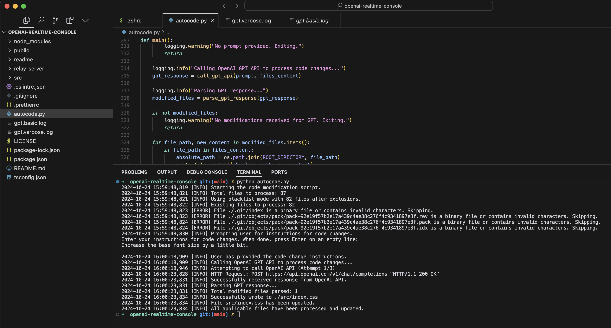

# Autocode

## Overview

Autocode is a Python script that uses OpenAI models to generate and apply code automatically from a prompt.

I built this to help me generate code for my projects faster, and the user experience of IDEs like Cursor don't cut it for me.

## Instructions

1. Add autocode.py to your project root directory.
2. Set the OPENAI_API_KEY environment variable in your terminal environment or set it in the autocode.py file.
3. Install openai `pip install openai`
4. Run the script `python autocode.py`
5. Add `gpt.basic.log` and `gpt.verbose.log` to your `.gitignore` file to avoid committing them.

## Example

## Contributing

If you want to contribute, feel free to open a PR.
